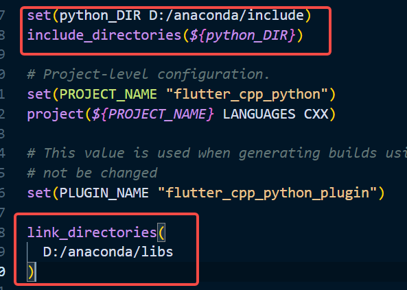

# flutter_cpp_python

a simple plugin bind flutter and python

## Getting Started

### Steps

* install `python` 

* set `PYTHONHOME`

* modify python lib path in `CMakeLists.txt` like this

  

* write some codes

* enjoy

**NOTES**

* run flutter in release mode

